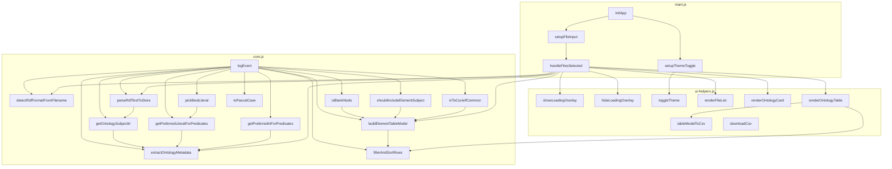

# tabulate-rdf
Makes a table out of an ontology or other RDF data

```mermaid
graph TD

  subgraph Core[core.js]
    logEvent --> detectRdfFormatFromFilename
    logEvent --> isBlankNode
    logEvent --> parseRdfTextToStore
    logEvent --> getOntologySubjectIri
    logEvent --> pickBestLiteral
    logEvent --> getPreferredLiteralForPredicates
    logEvent --> getPreferredIriForPredicates
    logEvent --> extractOntologyMetadata
    logEvent --> shouldIncludeElementSubject
    logEvent --> iriToCurieIfCommon
    logEvent --> toPascalCase
    logEvent --> buildElementTableModel
    logEvent --> filterAndSortRows

    parseRdfTextToStore --> getOntologySubjectIri
    getOntologySubjectIri --> extractOntologyMetadata
    pickBestLiteral --> getPreferredLiteralForPredicates
    getPreferredLiteralForPredicates --> extractOntologyMetadata
    getPreferredIriForPredicates --> extractOntologyMetadata

    isBlankNode --> buildElementTableModel
    shouldIncludeElementSubject --> buildElementTableModel
    iriToCurieIfCommon --> buildElementTableModel

    buildElementTableModel --> filterAndSortRows
  end

  subgraph UI[ui-helpers.js]
    showLoadingOverlay
    hideLoadingOverlay
    toggleTheme
    renderFileList
    renderOntologyCard
    renderOntologyTable --> filterAndSortRows
    renderOntologyTable --> tableModelToCsv
    tableModelToCsv
    downloadCsv
  end

  subgraph Main[main.js]
    initApp --> setupThemeToggle
    initApp --> setupFileInput
    setupThemeToggle --> toggleTheme
    setupFileInput --> handleFilesSelected
    handleFilesSelected --> detectRdfFormatFromFilename
    handleFilesSelected --> parseRdfTextToStore
    handleFilesSelected --> extractOntologyMetadata
    handleFilesSelected --> buildElementTableModel
    handleFilesSelected --> renderOntologyCard
    handleFilesSelected --> renderOntologyTable
    handleFilesSelected --> renderFileList
    handleFilesSelected --> showLoadingOverlay
    handleFilesSelected --> hideLoadingOverlay
  end


```